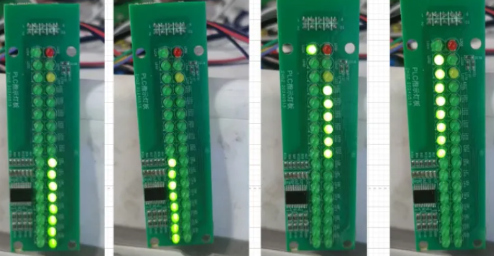
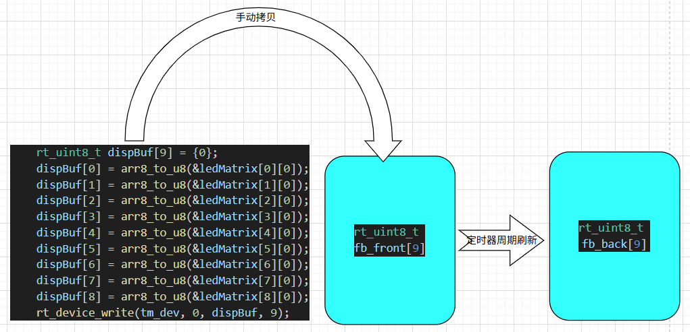
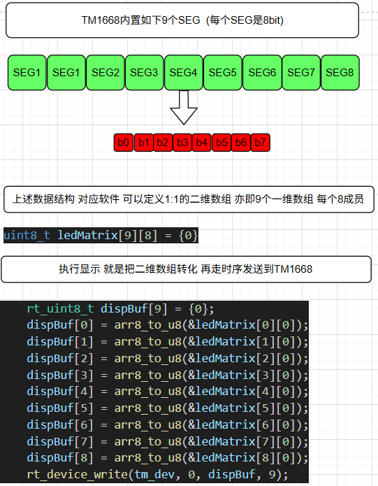

# TM1668 LED矩阵驱动程序（RT-Thread 适配）

## 项目简介

TM1668是一款专用的LED显示驱动芯片，广泛应用于7段数码管和点阵显示屏的控制。实战项目灯板如下。本项目是基于RT-Thread实时操作系统的TM1668驱动程序，提供完整的设备驱动框架和示例应用。


## 功能特点

- **完整的设备驱动框架**：遵循RT-Thread设备驱动模型
- **灵活的显示控制**：支持7×9 LED矩阵显示
- **高效的刷新机制**：内置定时刷新功能，刷新间隔可配置
- **标准化的接口**：符合RT-Thread设备注册标准
- **简单易用的API**：提供标准的read/write/open接口

## 硬件参数

| 参数 | 说明 |
|------|------|
| 段数(Seg) | 9段 |
| 栅格数(Grid) | 7栅格 |
| 数据引脚 | DIO (数据输入输出) |
| 时钟引脚 | CLK (时钟信号) |
| 片选引脚 | STB (片选信号) |

## 文件结构

```
tm1668/
├── src/
│   └── dev_tm1668.c      # TM1668设备驱动源码
├── example/
│   └── app_tm1668.c      # 示例应用程序
├── Kconfig               # 内核配置选项
├── SConscript            # SBuild构建脚本
├── LICENSE               # 开源许可证
└── package.json          # 包管理配置
```

## 依赖要求

- RT-Thread 实时操作系统 (版本 ≥ 4.0)
- GPIO设备驱动框架
- 定时器设备支持

## 驱动功能

### 核心接口函数

- `tm1668_hw_init()` - 硬件初始化
- `tm1668_dev_init()` - 设备初始化
- `tm1668_dev_open()` - 打开设备
- `tm1668_dev_write()` - 写入显示数据
- `tm1668_write_byte()` - 写单个字节
- `tm1668_send()` - 发送命令和数据

### 显示刷新

驱动程序内置自动刷新机制，通过`refresh_timer_cb()`回调函数实现定时刷新，确保显示内容的实时性和稳定性。

## 使用方法

### 1. 集成到工程

将`src/dev_tm1668.c`添加到您的工程中，并在适当位置调用`tm1668_hw_init()`进行初始化。

### 2. 设备注册

初始化完成后，TM1668将作为标准RT-Thread设备注册，可通过设备名称进行访问。

### 3. 数据写入

通过标准的设备写入接口向TM1668发送显示数据，数据格式为7×9矩阵形式。


## 示例程序

示例程序`app_tm1668.c`展示了基本的使用流程：

1. LED矩阵显示测试
2. 自定义字符映射
3. 数据显示转换



## 配置选项

可通过以下方式配置TM1668驱动：

- `TM1668_DEV_NAME` - 设备名称
- `TM1668_SEG_CNT` - 段数配置
- `TM1668_GRID_CNT` - 栅格数配置
- `REFRESH_INTERVAL` - 刷新间隔

## 应用场景

- 工业控制面板显示
- 仪器仪表数据显示
- 消费电子产品状态指示
- 小型信息发布系统

## 许可证

本项目基于 MIT 许可证开源，可自由用于商业和非商业项目，修改后需保留原版权声明。

## 联系方式

维护：龚金华
单位: 上海威派格智慧水务股份有限公司
邮箱：782730309@qq.com

